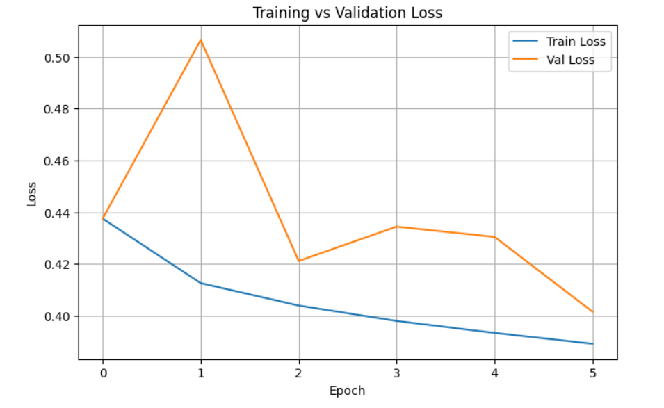
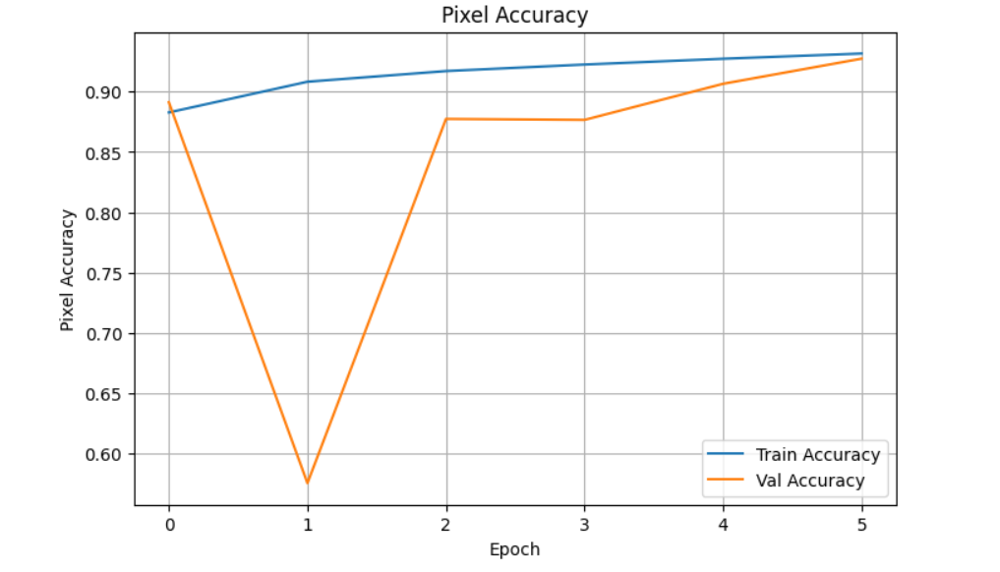
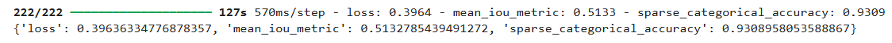
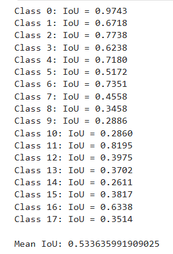
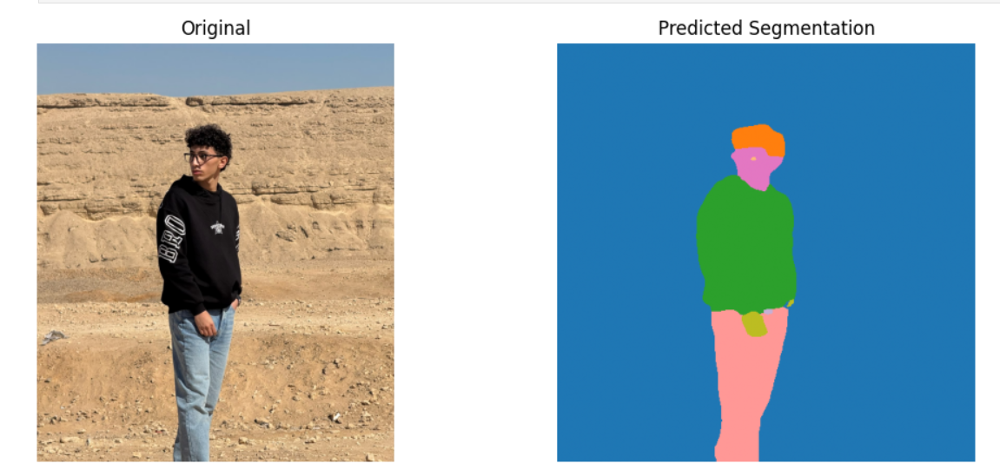
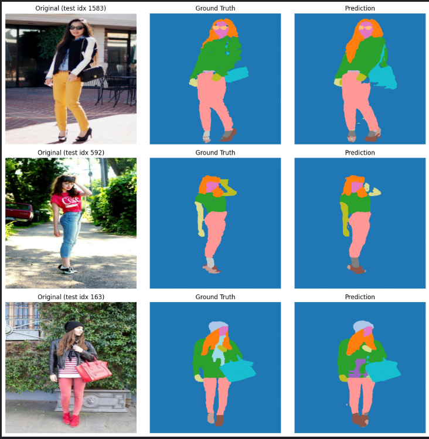

# Clothes Segmentation — DeepLabV3+ (ResNet50)

A deep-learning pipeline that segments clothes and body parts from images of people.

The model performs **18-class human/clothing parsing** (background, clothing items, accessories, body parts) using a **DeepLabV3+ architecture with a ResNet50 backbone**, trained on the [`mattmdjaga/human_parsing_dataset`](https://huggingface.co/datasets/mattmdjaga/human_parsing_dataset) (ATR dataset, 17,706 images).

See [`REPORT.pdf`](./REPORT.pdf) for the full write-up (dataset choice, architecture, loss function, evaluation, and limitations).

---

## Repository contents

| File / folder                          | Description                                                                 |
| --------------------------------------- | ----------------------------------------------------------------------------- |
| `config.py`                             | All hyperparameters, dataset settings, and output paths in one place          |
| `data_prep.py`                          | Loads the dataset from the Hugging Face Hub and splits it 80/10/10            |
| `data_processing.py`                    | Preprocessing, augmentation, tf.data pipeline, class-weight estimation        |
| `model.py`                              | DeepLabV3+ architecture (ASPP block + ResNet50 backbone)                      |
| `losses.py`                             | Combined focal + Dice loss, and the mean-IoU metric                           |
| `train.py`                              | End-to-end training entry point                                               |
| `eval.py`                               | Evaluation, per-class IoU, qualitative plots, single-image inference          |
| `clothes-segmentation-task.ipynb`       | Original exploratory notebook — kept for reference only, not the source of truth |
| `REPORT.pdf`                            | Full technical report required by the assignment                              |
| `requirements.txt`                      | Python dependencies                                                           |
| `human_parsing_unet_18_classes.keras`   | Final trained model weights (produced after training — see note below)       |
| `best_unet.keras`                       | Best checkpoint saved during training (lowest `val_loss`)                     |
| `outputs/`                              | Saved training curves, test metrics, and qualitative prediction images        |

> **Note on weights:** the `.keras` weight files are large binaries. If they are not committed to this repository (e.g. due to GitHub file-size limits), re-run `train.py` to reproduce them, or download them from the release/link provided separately, and place them in the repository root before running `eval.py`.

---

## 1. Setup

**Requirements:** Python 3.10+, and ideally a CUDA-capable GPU (training on CPU is possible but slow).

```
git clone <your-repo-url>
cd <your-repo-name>

python -m venv venv
source venv/bin/activate      # Windows: venv\Scripts\activate

pip install -r requirements.txt
```

The dataset is streamed automatically from the Hugging Face Hub the first time `data_prep.py` (or `train.py`) runs — no manual download needed.

---

## 2. Running the pipeline

All hyperparameters (image size, batch size, epochs, learning rate, seed, etc.) live in **`config.py`** — change values there instead of editing the scripts.

```
python train.py     # trains the model, saves best_unet.keras and the final .keras file
python eval.py       # evaluates on the test split, prints per-class IoU, shows qualitative plots
```

The pipeline stages, in order:

1. **Dataset loading & splitting** (`data_prep.py`) — 80% / 10% / 10% train/val/test split.
2. **Preprocessing & augmentation** (`data_processing.py`) — resize to 512×512, normalize images to `[0, 1]`, nearest-neighbor resize for masks; random horizontal flip, brightness, and contrast jitter (training split only).
3. **Model** (`model.py`) — `DeepLabV3+` with a `ResNet50` (ImageNet-pretrained) backbone and an ASPP module.
4. **Loss & metrics** (`losses.py`) — a combined weighted focal + weighted multiclass Dice loss, plus a custom mean-IoU metric.
5. **Training** (`train.py`) — `model.fit(...)` with checkpointing, learning-rate reduction, and early stopping.
6. **Evaluation** (`eval.py`) — loss/pixel-accuracy/mIoU on the held-out test set, per-class IoU, qualitative predictions, and inference on a new image via `predict_image(model, image_path)`.

The original notebook (`clothes-segmentation-task.ipynb`) walks through the same steps interactively and is kept for reference/exploration only — the scripts above are the version to run and to build on.

---

## 3. Reproducing the results

To retrain from scratch, run `python train.py`. Key configuration (in `config.py`, easy to change):

```
IMAGE_SIZE    = (512, 512)
NUM_CLASSES   = 18
BATCH_SIZE    = 8
EPOCHS        = 6
LEARNING_RATE = 1e-3
SEED          = 42
```

The random seed (`42`) is fixed for NumPy, Python's `random`, and TensorFlow, and the dataset split uses the same seed, so re-running the pipeline reproduces the same train/val/test partition and closely-comparable results.

Training saves two checkpoints automatically:

- `best_unet.keras` — best epoch by `val_loss` (via `ModelCheckpoint`)
- `human_parsing_unet_18_classes.keras` — final model saved at the end of training

---

## 4. Running inference on your own image

```python
from eval import load_trained_model, predict_image

model = load_trained_model()
original, pred_mask = predict_image(model, "path/to/your_photo.jpg")
```

`pred_mask` is a `512×512` array of class IDs (0–17); see [`REPORT.pdf`](./REPORT.pdf) for the full label map and recommended capture conditions for reliable results.

---

## 5. Model experiments

Three architectures were compared on the same data split and preprocessing pipeline:

| Model                          | Loss  | Pixel Accuracy | Mean IoU    |
| ------------------------------- | ----- | --------------- | ----------- |
| **DeepLabV3+ (ResNet50)** — final | 0.396 | 93.1%            | 0.513–0.534 |
| DeepLabV3+ (MobileNetV2)        | 0.45  | 91%              | 0.47        |
| U-Net                           | 0.62  | 89%              | 0.40        |

DeepLabV3+/ResNet50 was chosen as the final model: besides the better metrics, both the U-Net and DeepLabV3+/MobileNetV2 variants were noticeably weaker in qualitative inference results, not just on the aggregate numbers.

Full per-class breakdown, strengths, weaknesses, and limitations are in [`REPORT.pdf`](./REPORT.pdf).

---

## 6. Results

Training curves, held-out test metrics, and qualitative predictions from the final DeepLabV3+/ResNet50 model. Raw numbers are in [`outputs/metrics.txt`](./outputs/metrics.txt).

**Training vs. validation loss**



**Pixel accuracy**



**Test set evaluation**



**Per-class IoU**



**Inference on a real-world image (outside the dataset)**



**Qualitative test-set predictions (original / ground truth / prediction)**



## About

No description, website, or topics provided.
